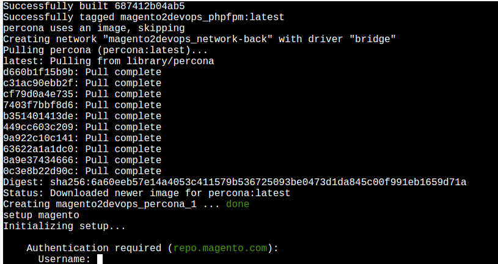

**Magento** 

```
$ cd /project
$ bash ./setup-work.sh
```


##### Access Keys [here](https://marketplace.magento.com/customer/accessKeys/)

```
$ cd /project
$ docker-compose up
```
Now, go to:
[localhost](http://localhost/)
